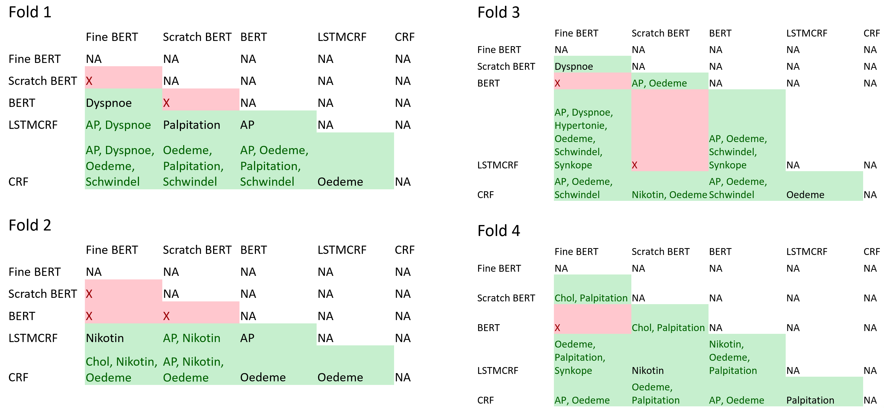

# Supplement: CardioAnnoBert - Automatic Extraction of Twelve Cardiovascular Concepts from German Discharge Letters using Pre-trained Language Models

## 1. Data
### 1.1. Main Corpus
The base corpus used in this project consists of discharge letters from cardiology domain as binary MS-DOC files. Discharge letters (Arztbriefe) vary a lot in scope and structure between different clinical domains. They are supposed to be short and concise. Next to personal data like the patients name, address and birth date, the notes shall contain past and current diagnoses. In addition patients' clinical history and planned clinical examinations are described. If accomplished, results of laboratory and sensoric examinations are as well part of a discharge letter. For more information see: https://de.wikipedia.org/wiki/Arztbrief\#cite_note-1
    
Length of the discharge letters in our data set vary a lot. The letters contain between half a DIN A4 page to approximately four pages. 
    
All documents share a basic structure. Thus, typical for clinical routine text data, they contain a semi-structure. The majority of the discharge letters contain a header containing contact information, a salutation, a clinical section and a summary. The clinical section typically contains a subset of the following subsections: diagnosis, cardiovascular risk factors, allergies, anamnese, physical examination (Körperlicher Untersuchungsbefund), laboratory data, ECG, MRI and recommended therapy/medication.
The amount of text in each subsection is varying. The subsections contain free unstructured text, sometimes tables, rarely images. 
Occasionally subsections are titled differently, but contain similar information, e.g. therapy/medication. Often terms are abbreviated, e.g. CRF/Cardiovascular risk factors. The letters are concluded by a salutation and the names of the physicians involved. Figure 1 shows a dummy discharge letter:

Figure 1: Example discharge letter.

### 1.2. Sampling Method
To obtain representative samples for annotation from our base corpus, we needed to sample a subset of discharge letters. As a probability sampling plan, to avoid too much bias, we chose stratified sampling. We performed the following steps:
* We divided our base corpus into groups of years 2004-2019. Then we randomly selected letters from each group (strata). We sampled 12 documents per strata in 2004-2012 and 24 documents per strata in 2013-2019. We chose to select twice as much documents per strata for the years 2013-2019, to keep the corpus more up-to-date.
* As our sample size is restricted to anamnese and risk factor sections of each discharge letter we obtain two constraints to our stratified sampling plan.
    * 75% of each strata we randomly selected  discharge letters from the 100 largest anamnese sections (with at least 70 token) from that strata, in order to not choose letters containing too short anamnese and risk factor sections. The longest anamnese section is always included.
    * 25% of each strata we randomly selected from letters  where the anamnese (with at least 45 token) contains the key words NYHA and CSS. This constraint is optional, if the key words are not available in a strata, we choose 100% from first constraint.

In total we sampled 204 discharge letters from the corpus. Following our annotation workflow for redundant annotation we split the corpus into a seed corpus (34 letters) for redundant annotation and a main corpus (170 letters). In addition the main corpus was split into a small subset containing 35 documents to annotate redundantly and a larger set of 135 documents for single annotation.

## 2. Cardiovascular Concepts

Table 1: Cardiovascular Concepts including ICD-10 code (if available) and description. 

| Cardiovascular Concept | ICD-10 | Description | Instances |
|--|--|--|
|	Angina Pectoris | I20 | describes a chest pain or preassure. It is graded using the CCS classification. Value range is 1-4, while ranges like "2-3" can be used for annotation. | 187  |
|        Cholesterine/Lipide |  E78.* | This describes all appearances of cholesterols or lipids, mostly expressed as cardiovascular risk factors. It is not graded.    | 36 |
|        Diabetes Mellitus    |  E10-14 |  Diabetes Mellitus is a metabolic disorder characterized by high blood sugar level. It is graded with the value range 1-2.    | 38 |
|        Dyspnoe    |   R06.0 | Dyspnoe describes a feeling of not being able to breathe sufficiently.It is graded using the NYHA classification. Value range is 1-4, while ranges like "2-3" can be used for annotation.    | 100 |
|        Familienanamnese   | None |    Familial anamnesis is a kind of anamnesis, which gives information about specific disease of family members. It is not graded.    | 24 |
|        Hypertonie    |  I10.*  | Hypertension describes the disease when blood pressure in the arteries is persistently elevated. It is not graded.    ||
|        Nikotinkonsum    | F17.* |  Describes a state of dependence of nicotine. It is graded if the amount of pack years is expressed in the document.     |
|        Nykturie    | R35 | Nocturia describes the need of a patient to wake up in the night to urinate. It is graded if the amount of times, the patient needs to get up in the night is expressed in the document.    |
|        Ödeme    |    R60 | Edema is the swelling of body tissue due to fluid retention. Value range of grading is 1-2.    |
|        Palpitation    |    R00.2 | Palpitation describe the conscious awareness of your own heartbeat. It is not graded.    |
|        Schwindel    |   H81-82  | Vertigo describes the feeling of turning or swaying. It is not graded.    |
|        Synkope    |  R55 | Syncopes describes the sudden loss of consciousness. It is not graded.|

## 3. Baseline Classifier

### CRF Classifier

Feature functions CRF:

| Feature | Description | Value | Example token, Value |
|--|--|--|--|
| isLowerCase* | Token is lower-cased | binary | 'pektangiöse', True |
| lastThreeChars | Last three characters of token | string | 'pektangiöse', 'öse' |
| lastTwoChars | Last two characters of token | string | 'pektangiöse', 'se' |
| isUpperCased* | Token is upper-cased | binary | 'pektangiöse', False |
| firstCharCapitalized* | First character is capitalized | binary | 'Angina', True |
| isDigit | Token is integer value | binary | '15', True |
| POSTag* | Part-of-speech-tags generated using SpaCy's *de_core_news_md* model  | Universal POS tags | 'Angina', 'NOUN' |
| POSTagLastTwoCharacters* | Last two characters of POS tag | string | 'Angina', 'UN' |
| EndOfSentence | token is end of sentence | binary | '.', True |
| BeginningOfSentence | token is beginning of sentence | binary | 'Der', True |

*\* Feature is used as well for context token (+1: subsequent token, -1: preceding token)*

Details CRF:

1. Library: sklearn-crfsuite==0.3.6
2. Algorithm: lbfgs
3. Hapyerparameters: c1=0.01, c2=0.5, max_iterations=100, all_possible_transitions=False

### LSTM Classifier

Architecture LSTM classifier:

1. An embedding layer using 850B Glove embeddings with dimension 300.
2. A bidirectional LSTM layer with dimension 128.
3. A 0.25 dropout layer
4. A dense layer with dimension 64
5. A final crf layer

Hyperparamters LSTM classifier:

1. Batchsize: 64
2. Epochs: 30
3. Early stopping after five epoechs on validation loss
4. Validation split 10%
5. maximum sequence length: 512

## 4. Results

### Precision/Recall Balance

Figure 2: Balance between precision and recall per concept of the two baseline models and the BERT models. Each data point in the scatter plots represents a cardiovascular concept. Defining the regression line with y = b + ax, an optimal result would be: r2=1, a slope coefficient of a=1 and a bias b=0.

### Significance test

Figure 3: Cardiovascular concepts per fold per model achieving p-value>0.5 using F1-score and approximate randomization (Yeh 2000, Pado 2006). E.g. Comparing the models difference of F1-score performance between Bertbase and CRF the concepts *AP*, *Oedeme*, *Palpitation* and *Schwindel* achieve a significance level p-value>0.5 in fold 1.

