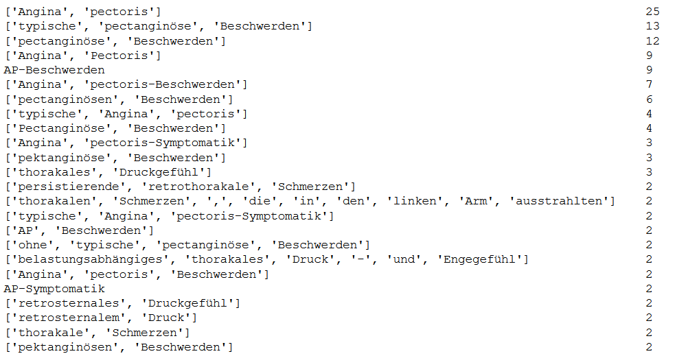

# Supplement: CardioAnno – Towards a German Clinical Corpus Containing Cardiovascular Concepts

## 1. Data
### 1.1. Main Corpus
The base corpus used in this project consists of discharge letters from cardiology domain as binary MS-DOC files. Discharge letters (Arztbriefe) vary a lot in scope and structure between different clinical domains. They are supposed to be short and concise. Next to personal data like the patients name, address and birth date, the notes shall contain past and current diagnoses. In addition patients' clinical history and planned clinical examinations are described. If accomplished, results of laboratory and sensoric examinations are as well part of a discharge letter. For more information see: https://de.wikipedia.org/wiki/Arztbrief\#cite_note-1
    
Length of the discharge letters in our data set vary a lot. The letters contain between half a DIN A4 page to four pages. 
    
All documents share a basic structure. Thus, typical for clinical routine text data, they contain a semi-structure. The majority of the discharge letters contain a header containing contact information, a salutation, a clinical section and a summary. The clinical section typically contains a subset of the following subsections: diagnosis, cardiovascular risk factors, allergies, anamnese, physical examination (Körperlicher Untersuchungsbefund), laboratory data, ECG, MRI and recommended therapy/medication.
The amount of text in each subsection is varying. The subsections contain free unstructured text, sometimes tables, rarely images. 
Occasionally subsections are titled differently, but contain similar information, e.g. therapy/medication. Often terms are abbreviated, e.g. CRF/Cardiovascular risk factors. The letters are concluded by a salutation and the names of the physicians involved. Figure 1 shows a dummy discharge letter:

Figure 1: Example discharge letter.

### 1.2. Sampling Method
To obtain representative samples for annotation from our base corpus, we needed to sample a subset of discharge letters. As a probability sampling plan, to avoid too much bias, we chose stratified sampling. We performed the following steps:
* We divided our base corpus into groups of years 2004-2019. Then we randomly selected letters from each group (strata). We sampled 12 documents per strata in 2004-2012 and 24 documents per strata in 2013-2019. We chose to select twice as much documents per strata for the years 2013-2019, to keep the corpus more up-to-date.
* As our sample size is restricted to anamnese and risk factor sections of each discharge letter we obtain two constraints to our stratified sampling plan.
    * 75% of each strata we randomly selected  discharge letters from the 100 largest anamnese sections (with at least 70 token) from that strata, in order to not choose letters containing too short anamnese and risk factor sections. The longest anamnese section is always included.
    * 25% of each strata we randomly selected from letters  where the anamnese (with at least 45 token) contains the key words NYHA and CSS. This constraint is optional, if the key words are not available in a strata, we choose 100% from first constraint.

In total we sampled 204 discharge letters from the corpus. Following our annotation workflow for redundant annotation we split the corpus into a seed corpus (34 letters) for redundant annotation and a main corpus (170 letters). In addition the main corpus was split into a small subset containing 35 documents to annotate redundantly and a larger set of 135 documents for single annotation.

## 2. Cardiovascular Concepts

Table 1: Cardiovascular Concepts including ICD-10 code (if available) and description. 

| Cardiovascular Concept | ICD-10 | Description |
|--|--|--|
|	Angina Pectoris | I20 | describes a chest pain or preassure. It is graded using the CCS classification. Value range is 1-4, while ranges like "2-3" can be used for annotation. |   
|        Cholesterine/Lipide |  E78.* | This describes all appearances of cholesterols or lipids, mostly expressed as cardiovascular risk factors. It is not graded.    |
|        Diabetes Mellitus    |  E10-14 |  Diabetes Mellitus is a metabolic disorder characterized by high blood sugar level. It is graded with the value range 1-2.    |
|        Dyspnoe    |   R06.0 | Dyspnoe describes a feeling of not being able to breathe sufficiently.It is graded using the NYHA classification. Value range is 1-4, while ranges like "2-3" can be used for annotation.    |
|        Familienanamnese   | None |    Familial anamnesis is a kind of anamnesis, which gives information about specific disease of family members. It is not graded.    |
|        Hypertonie    |  I10.*  | Hypertension describes the disease when blood pressure in the arteries is persistently elevated. It is not graded.    |
|        Nikotinkonsum    | F17.* |  Describes a state of dependence of nicotine. It is graded if the amount of pack years is expressed in the document.     |
|        Nykturie    | R35 | Nocturia describes the need of a patient to wake up in the night to urinate. It is graded if the amount of times, the patient needs to get up in the night is expressed in the document.    |
|        Ödeme    |    R60 | Edema is the swelling of body tissue due to fluid retention. Value range of grading is 1-2.    |
|        Palpitation    |    R00.2 | Palpitation describe the conscious awareness of your own heartbeat. It is not graded.    |
|        Schwindel    |   H81-82  | Vertigo describes the feeling of turning or swaying. It is not graded.    |
|        Synkope    |  R55 | Syncopes describes the sudden loss of consciousness. It is not graded.|

Figure 2: Distribution of sequence length per concept.

Figure 3: Distribution of concept counts per document.

Figure 4: Sequence examples for concept angina pectoris, which appeared at least twice in the corpus.

Table 2: Inter annotator agreement per concept per corpus split including average seed.

|Cardiovascular Concept  | Seed1 | Seed2 | Seed3 | Avg. Seed | Main35 |
|--|--|--|--|--|--|
|AP|72.1|80.6|93.9|82.2|78|
|Cholesterin|94.1|94.7|100|96.2|95.2|
|Diabetes|100|100|88.9|96.3|96|
|Dyspnoe|92.3|91.7|62.5|81.1|82.5|
|FA|57.1|80|94.7|77.1|95.2|
|Hyp|100|95.7|100|98.5|98.1|
|Nikotin|93.3|92.3|100|95.2|97|
|Nykturie|88.8|90.9|100|93.2|100|
|Oedeme|80|95.2|93.3|89.5|97.6|
|Palpitation|92.3|100|66.7|86.3|84.8|
|Schwindel|83.3|88.8|100|90.7|90|
|Synkope|100|83.3|92.3|91.9|100|

## 3. Inter Annotator Agreement

Table 3: Examples for evaluating entity-wise exact and partial IAA.

|A | B | Exact | Partial | Type
|--|---|--|--|--|
|17,4-17,5 Hyp | = | TP | TP | exact range match |
|17,8 FA | = | TP | TP | exact single match|
|17,12-17,16 FA | X | FN | FN | no annotation in B|
|20,43 Palpitation | X | FN | FN | no annotation in B|
|20,67 Dyspnoe | = | TP | TP | exact single matc|
|20,70 Schwindel | = | TP | TP | exact single matc|
|20,106 Dyspnoe | = | TP | TP | exact single match|
|X | 20,110-20,111 Dyspnoe | FP | FP | no annotation in A|
|20,119-20,120 AP | = | TP | TP | exact range match|
|20,128 Palpitation | = | TP | TP | exact single match|
|20,133 Schwindel | = | TP | TP | exact single match|
|20,141 Synkope | = | TP | TP | exact single match|
|20,162-20,164 Ödeme | 20,162-20,163 Ödeme | FP | TP | range token with partial overlap, same class, same start token|
|21,210 Synkope | 21,210 Hyp | FP | FP | single token match different class|
|21,220-224 Dyspnoe | 21,221-222 Dyspnoe | FP | TP | range token partial overlap, same class, different start and end token|
|21,225-21,226 FA | 21,225-21,226 Schwindel | FP | FP | range token exact match different class|
|21,231 Schwindel | 21,230-21,232 Schwindel | FP | TP | single token vs range token same class|
|21,246-21,248 Synkope | 21,246 Schwindel | FP | FP | range token vs single token different class | 

Table 3 contains the annotation of annotator A, column two the annotation of annotator B. Column three and four contain the evaluation using IAA entitywise exact and partial match. The last column contains further descriptions. *20,110-20,111 Dyspnoe* means: in paragraph 20, token 110 and token 111 are annotated as Dyspnoe.

Entitywise exact match IAA score results in: 

*Precision = tp/fp+tp = 10 / 7 + 10 = 0.59*

*Recall = tp/fn + tp = 10 / 2 + 10 = 0.83*

*F1 = 0.69*

Entitywise partial match IAA score results in: 

*Precision = tp/fp+tp = 12 / 7 + 12 = 0.63*

*Recall = tp/fn + tp = 12 / 2 + 12 = 0.86*

*F1 = 0.73*

## 4. LSTM Classifier

Table 4: Mean average 4-fold corss validated results per concept of the LSTM classifier.

|Cardiovascular Concept |Precision|Recall|F1-score|Instances|
|--|--|--|--|--|
|AnginaPectoris|0.87|0.62|0.725|187|
|Hypertonie|0.8925|0.9075|0.8975|103|
|Cholesterin/Lipide|0.9045|0.85|0.885|36|
|Dyspnoe|0.815|0.6525|0.717|100|
|Schwindel|0.97|0.795|0.87|44|
|Synkope|0.9425|0.7725|0.85|52|
|Palpitation|0.865|0.665|0.735|45|
|Familienanamnese|0.85|0.7175|0.765|24|
|Oedeme|0.9525|0.6775|0.785|63|
|Nikotinkonsum|0.9725|0.7925|0.87|30|
|Nykturie|1|0.85|0.9175|19|
|DiabetesMellitus|0.9025|0.905|0.8975|38|
|micro avg|0.895|0.7275|0.8|738|
|macro avg|0.9125|0.7675|0.825|738|
|weighted avg|0.9|0.7275|0.7975|738|

The classifier had the following architecture:

1. An embedding layer using 850B Glove embeddings with dimension 300.
2. A bidirectional LSTM layer with dimension 128.
3. A 0.25 dropout layer
4. A dense layer with dimension 64
5. A final crf layer

Following hyperparamters had been applied:
1. Batchsize: 64
2. Epochs: 30
3. Early stopping after five epoechs on validation loss
4. Validation split 10%
5. maximum sequence length: 512
